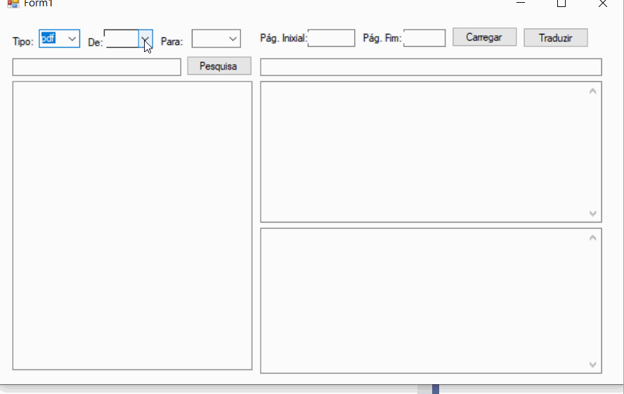

# TextTradutor

Translate files like pdf, txt, md, etc. Allows set one language to another. In the demo there are Portuguese(BR), English, Japanese and German.

<h2 align="center">
  
  
</h2>

## 👅 Languages

- [README in English](README-EN.md)
- [README in German/Deustch](README-DE.md)
- [README in Japanese](README-JA.md)

## 📌 Index

  <a href="#about-textTradutor">About TextTradutor</a>&nbsp;&nbsp;&nbsp;|&nbsp;&nbsp;&nbsp;
  <a href="#visuals-and-screenshots">Visuals and Screenshots</a>&nbsp;&nbsp;&nbsp;|&nbsp;&nbsp;&nbsp;
  <a href="#technologies">Technologies </a>&nbsp;&nbsp;&nbsp;|&nbsp;&nbsp;&nbsp;
  <a href="#installation">Installation and Features</a>&nbsp;&nbsp;&nbsp;|&nbsp;&nbsp;&nbsp;
  <a href="#issues"> Issues </a>  &nbsp; &nbsp; &nbsp; | &nbsp; &nbsp; &nbsp;  
  <a href="#contributions">Contributions</a> &nbsp;&nbsp;&nbsp;|&nbsp;&nbsp;&nbsp;
  <a href="#authors-and-acknowledgment">Authors and acknowledgment</a> &nbsp;&nbsp;&nbsp;|&nbsp;&nbsp;&nbsp;
    <a href="#references">References</a> &nbsp;&nbsp;&nbsp;|&nbsp;&nbsp;&nbsp;
  <a href="#license">License</a> 

 ## ❔ About TextTradutor  

Tired of Google Translator that recently restricted the text lenght to translations and because I was willing to search a wordor phrase on my own files and translate it the project was born.  

This project allow you to cunstomize your outputs and inputs, replacing words, deleting caracters or spaces, and so on.     

## 📸 Visuals and Screenshots

  

## 🐛 Issues  

> Feel free to register a new problem with its title and description in the Proffy repository.  
> If you have already found a solution to your problem, I would love to review your pull request! 

## 🤝 Contributions 

Follow the steps below to contribute:

1. *Fork* the project (<https://github.com/shyoutarou/TextTradutor.git>)

2. Clone your *fork* to your machine (`git clone https://github.com/user_name/TextTradutor.git`)

3. Create a *branch* to perform your modification (`git checkout -b feature/name_new_feature`)

4. Add your modifications and *commit* (`git commit -m "Describe your modification"`)

5. *Push* (`git push origin feature/name_new_feature`)

6. Create a new *Pull Request*

7. Okay, now just wait for the analysis

## Authors and acknowledgment

 

  <table style="width:100%">
    <tr align=center>
      <th><strong>Eu</strong></th>
    </tr>
    <tr align=center>
      <td>
        
      </td>
    </tr>
  </table>

 

## 📜 License             

The project published in 2020 on the license [MIT](./LICENSE) ❤️           
Made with ❤️ by Shyoutarou           
Liked?  Leave a little star to help the project ⭐           

- [Back to Top](#index)

